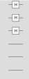
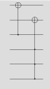
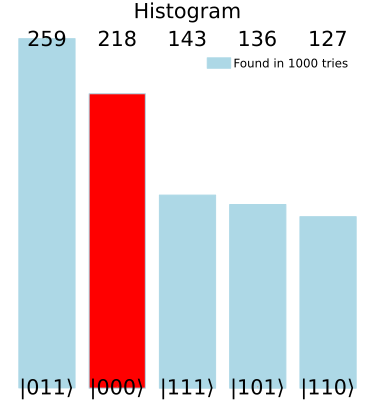
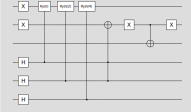
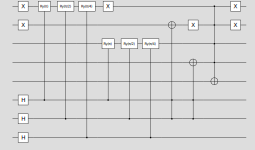
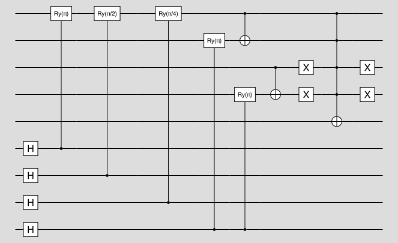
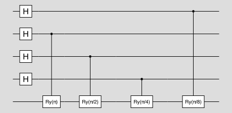
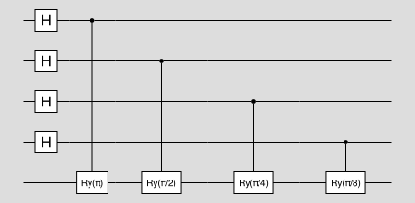
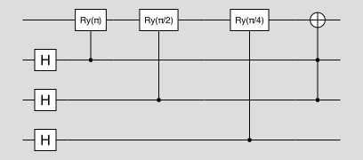

# GroverCircuitBuilder Module for Quantum Machine Learning

## Introduction
This module written in Julia uses the Yao.jl framework and automates the creation of quantum circuits
specifically tailored for QML training using amplitude amplification.
It is a Proof-of-Concept implementation in the setting where portions of a circuit are parameterized using dedicated parameter qubits. These parameter qubits are then tuned using amplitude amplification according to a cost function.

For example, consider the simple case where we want to learn a quantum circuit that generates
samples from the [Bernoulli distribution](https://en.wikipedia.org/wiki/Bernoulli_distribution) with $p=\frac{3}{4}$. Given the observations $1,0,1,1$, we construct the following quantum circuit:


In this setting, the amplitude of the parameter qubits are to be amplified, when the target qubit is 1.
Measuring the parameter qubits then yields a quantum circuit model for the Bernoulli distribution, which we aim to learn.

## Installation

### Prerequisites
- Julia programming environment

### Setting Up the Module
1. Clone the repository or download the module files to your local machine.
2. Ensure that Julia and all necessary packages are installed.

## Usage

### Basic Setup and Module import

Include this code at the beginning of your script. This will automatically import all necessary modules. Note that these are relative paths and might need to be changed according to your file structure.

```julia
include("../Modules/SetupTool.jl")

using .SetupTool
if setupPackages(false, update_registry = false)
    include("../Modules/GroverML.jl")
    include("../Modules/GroverCircuitBuilder.jl")
    include("../Modules/GroverPlotting.jl")
end

using .GroverML
using .GroverCircuitBuilder
using .GroverPlotting
using Yao
using Yao.EasyBuild, YaoPlots

configureYaoPlots()
```

If you experience any issues with the way modules are imported, you could use the code below as a workaround. However, then you will not be able to see module documentation.

```julia
include("../Modules/SetupTool.jl")
using .SetupTool
setupPackages(false, update_registry = false)
using Revise

Revise.includet("../Modules/GroverML.jl")
using .GroverML
Revise.includet("../Modules/GroverCircuitBuilder.jl")
using .GroverCircuitBuilder
Revise.includet("../Modules/GroverPlotting.jl")
using .GroverPlotting
configureYaoPlots()
using Yao
using Yao.EasyBuild, YaoPlots
```

### Model and parameter lanes

In our module, we divide the circuit into two main components, the `parameter lanes` and the `model lanes`. This division should help organize the circuit. The `model lanes` are all lanes controlled by the model parameters. The `parameter lanes` represent the parameters of the model.

By default, `model lanes` come before `parameter lanes`. If you want to apply any gate on a `parameter lane`, you can access the `n`-th `model lane` using the index `n`. If you want to access the `m`-th `parameter lane`, then you need to use the index `length(model lanes) + m`.

Keep in mind that the division into `model` and `parameter` lanes is helpful, but not necessary. In general, you can create any circuit you want and everything should still work.

### Creating a circuit

You can create a new circuit by:

```julia
# Initialize an empty circuit with 2 model lanes and 4 parameter lanes
grover_circ = empty_circuit(2, 4)
```

where the first argument is the total number of `model lanes` and the second argument is the total number of `parameter lanes`.

### Building a circuit

You can build circuits using the modules integrated functions. A circuit is built sequentially, meaning that new gates are added to the end of the circuit. For all examples, we assume to have `2` `model lanes` and `4` `parameter lanes` as in the [previous example](#creating-a-circuit).

When referencing circuits, we recommend avoiding absolute indices. Instead, you can access all `model lane`- and `parameter lane` indices using the functions

```julia
model_lanes(grover_circ)
```

and 

```julia
param_lanes(grover_circ)
```

This will ensure that the correct lanes are accessed, even if you change the order of the lanes.

#### Hadamard gates

You can apply Hadamard gates using the function `hadamard`.

```julia
hadamard(grover_circ, model_lanes(grover_circ)[3])
```

Assuming we have an empty circuit, this will add a Hadamard gate to the `3`-rd `model lane`.


We can also apply Hadamard gates to multiple `lanes` at once, using either

```julia
hadamard(grover_circ, model_lanes(grover_circ)[1:3])
```

or

```julia
hadamard(grover_circ, [model_lanes(grover_circ)[1], model_lanes(grover_circ)[2], model_lanes(grover_circ)[3]])
```

This will add a Hadamard gate to the `1`-st, `2`-nd and `3`-rd `model lane`.



You can also add controlled Hadamard gates by specifing the `control lanes`

```julia
hadamard(grover_circ, model_lanes(grover_circ)[1], control_lanes = param_lanes(grover_circ)[1])
```


Each hadamard gate can be controlled by multiple `control lanes` (usually `parameter lanes`)

```julia
hadamard(grover_circ, model_lanes(grover_circ)[1], control_lanes = param_lanes(grover_circ)[2:3])
```


You can also specify multiple controlled Hadamard gates at once

```julia
hadamard(grover_circ, model_lanes(grover_circ)[1:2], control_lanes = [param_lanes(grover_circ)[1], param_lanes(grover_circ)[2:4]])
```


#### Not gates

You can apply Not gates using the function `not`.

```julia
not(grover_circ, model_lanes(grover_circ)[3])
```


You can also apply multiple Not gates, as well as controlled Not gates, in the same way as for [Hadamard gates](#hadamard-gates).

```julia
not(grover_circ, model_lanes(grover_circ)[1:2], control_lanes = [param_lanes(grover_circ)[1], param_lanes(grover_circ)[2:4]])
```



#### Learned rotation gates

Learned rotations are granular rotations that can be learned by a classical optimizer. The granularity of such a `learned rotation` is dependent on the number of control lanes. In general, we can learn $2^n$ individual rotations where $n$ is the number of control lanes. This function is implemented as `learned_rotation`.

```julia
learned_rotation(grover_circ, model_lanes(grover_circ)[1], param_lanes(grover_circ)[3:6])
```


### Custom yao gates

You can also add custom yao gates using the function `yao_block`. However, as we cannot automatically determine the inverse gate (at least not a gate representation), you need to specify the inverse as well.
Keep in mind that the sequence order is reversed for the inverse gate. Only use this function if you know what you are doing. More complex algorithms of our module might break when you use this function. 

```julia
custom_block = chain(2, put(1 => Rz(pi)), put(2 => Rz(pi)))
custom_block_inv = chain(2, put(2 => Rz(-pi)), put(1 => Rz(-pi)))
yao_block(grover_circ, [1:2, 1:2], custom_block, custom_block_inv, control_lanes=[3:4, 5:6])
```


The lane behavior is analogous to all other gates.

### Compiling a circuit

You can compile a circuit using the function `compile_circuit`.

```julia
my_circuit = compile_circuit(grover_circ)
```

This will compile the circuit and return a `Yao` circuit. You can also compile the inverse circuit using the flag `inv`.

```julia
my_circuit = compile_circuit(grover_circ, inv = true)
```

### Visualizing a circuit

You can visualize a circuit using the function `vizcircuit`.

```julia
vizcircuit(my_circuit)
```

### Visualize measurements

You can visualize the measurements of a circuit using the function `plotmeasure`. This function takes any number of measurements and plots them in a bar chart.

```julia
plotmeasure(measurements)
```

For example, let's measure a learned rotation after applying Hadamard gates on the `model lanes`.

```julia
grover_circ = empty_circuit(1, 2)

hadamard(grover_circ, 2:3)
learned_rotation(grover_circ, 1, 2:3)

my_circuit = compile_circuit(grover_circ)
```

Now, we visualize the circuit:

```julia
vizcircuit(my_circuit)
```


And we visualize the measurements:

```julia
measurements = zero_state(3) |> my_circuit |> r->measure(r; nshots=1000)
plotmeasure(measurements)
```


Keep in mind that the last bit is our model lane, while the first two bits are our parameter lanes.

We provided some optional arguments to make the plot easier to understand. For instance, we can provide an oracle_function to highlight the desired output states. Let's say we want to highlight the first three bars:

```julia
plotmeasure(measurements; oracle_function=i -> i==1||i==5)
```


Keep in mind that the first quantum state `|000>` is represented by the index `1` (and not `0`).
We can also sort the plot regarding the most appearing states:

```julia
plotmeasure(measurements; oracle_function=i -> i==1||i==5, sort=true)
```


We can also limit the number of entries that are displayed. This setting usually makes sense when plotting a sorted histogram to get the `n` top quantum states.

```julia
plotmeasure(measurements; oracle_function=i -> i==1||i==5, sort=true, num_entries=5)
```



### Model training

Let's create a model and train it on a simple dataset. We define the model as follows:

```julia
grover_circ = empty_circuit(1, 3)

hadamard(grover_circ, param_lanes(grover_circ)[1:3])
learned_rotation(grover_circ, model_lanes(grover_circ)[1], param_lanes(grover_circ)[1:3])
not(grover_circ, model_lanes(grover_circ)[1]; control_lanes = [param_lanes(grover_circ)[1:2]])
```

We can visualize the circuit:

```julia
my_circuit = compile_circuit(grover_circ)
vizcircuit(my_circuit)
```


Let's have a look at the measurements without training the model. Note that we use the `auto_compute` function to obtain the corresponding oracle function to highlight the desired states.

```julia
_, my_circuit, _, oracle_function = auto_compute(grover_circ, [true]; evaluate = false, forced_grover_iterations = 0)

measured = zero_state(4) |> my_circuit |> r->measure(r; nshots=1000)
plotmeasure(measured; oracle_function=oracle_function)
```


Let's say we want the model to map `|0>` to `|1>` (at the model lane). Thus, we want to minimize the states where the `model lane` does not return `1` (the last bit in the graph above). We can do that using the `auto_compute` function.

```julia
out, main_circuit, grover_iterations, oracle_function = auto_compute(grover_circ, [true])
```

The parameter `[true]` specifies the desired `output value`. The function `auto_compute` will automatically compute the optimal number of Grover iterations and apply them to the circuit. Keep in mind that the `output values` have to match that specified number of `model lanes`. If you do not want a model lane to be trained on any specific value, you can insert `nothing` into the vector at the desired lane index. The function returns the quantum state after applying the circuit, the circuit without the amplitude amplification and the grover iterations as a circuit.
Executing this code should generate the following logs:

```
[ Info: Simulating grover circuit...
[ Info: Main circuit compiled
[ Info: Evaluating main circuit...
[ Info: Main circuit evaluated
[ Info: Cumulative Pre-Probability: 0.588388347648318
[ Info: Angle towards orthogonal state: 0.8742534638200038
[ Info: Angle towards orthogonal state (deg): 50.091033701579434
[ Info: Optimal number of Grover iterations: 4
[ Info: Actual optimum from formula: 0.39836437131823643
[ Info: Compiling grover circuit...
[ Info: Grover circuit compiled
[ Info: Evaluating grover circuit...
[ Info: Grover circuit evaluated
[ Info: 
[ Info: ======== RESULTS ========
[ Info: =========================
[ Info: 
[ Info: Cumulative Probability (after 4x Grover): 0.9997955370807339
[ Info: Predicted likelihood after 4x Grover: 0.9997955370807381
```

As displayed in the logs, we could increase the probability of measuring a `1` at the model lane from `0.588` to `0.999` by applying `4` Grover iterations. 

When executing the function `auto_compute`, there are four outputs:
- `out`: The quantum state after applying the circuit including the amplitude amplification
- `main_circuit`: The compiled circuit without the amplitude amplification
- `grover_iterations`: The `4` grover iterations as a circuit
- `oracle_function`: A function that returns true if the given quantum state (as an Int) is a desired output

We can visualize the measured states using `1000` different measurements:

```julia
measured = out |> r->measure(r; nshots=1000)
plotmeasure(measured; oracle_function=oracle_function)
```


As we can see, the probability of measuring a `1` at the model lane is now much higher than before.

### Model training with multiple model lanes

We can also train a model that returns multiple target values. Let's define another model that has a two-bit output. Let's define the model as follows:

```julia
grover_circ = empty_circuit(2, 3)

# Apply Hadamard gates on the model lanes
hadamard(grover_circ, param_lanes(grover_circ))

# Apply a Learned Rotation on the first model lane
learned_rotation(grover_circ, model_lanes(grover_circ)[1], param_lanes(grover_circ))

# Apply a controlled Not gate on the second model lane
not(grover_circ, 2; control_lanes = [param_lanes(grover_circ)[1:2]])
```

We can visualize the circuit:

```julia
my_circuit = compile_circuit(grover_circ)
vizcircuit(my_circuit)
```


Now, let's train the model to return `|11>` at the `output lanes`. We can do that using the `auto_compute` function.

```julia
out, main_circuit, grover_iterations, oracle_function = auto_compute(grover_circ, [true, true])
```

Executing this code should generate the following logs:

```
[ Info: Simulating grover circuit...
[ Info: Inserting grover-lane after lane number 2
[ Info: Main circuit compiled
[ Info: Evaluating main circuit...
[ Info: Main circuit evaluated
[ Info: Cumulative Pre-Probability: 0.08080582617584074
[ Info: Angle towards orthogonal state: 0.2882383126101803
[ Info: Angle towards orthogonal state (deg): 16.514838806535785
[ Info: Optimal number of Grover iterations: 2
[ Info: Actual optimum from formula: 2.2248222357575265
[ Info: Compiling grover circuit...
[ Info: Grover circuit compiled
[ Info: Evaluating grover circuit...
[ Info: Grover circuit evaluated
[ Info: 
[ Info: ======== RESULTS ========
[ Info: =========================
[ Info: 
[ Info: Cumulative Probability (after 2x Grover): 0.9832964456500823
[ Info: Predicted likelihood after 2x Grover: 0.9832964456500849
```

Now, we visualize the `main_circuit`:

```julia
vizcircuit(main_circuit)
```


When inspecting the `main_circuit`, we can observe that the circuit does not match the circuit we defined above. This is because if we add multiple `output values`, the module will automatically insert a `grover lane`, which is a lane that is controlled by all `output lanes`. This makes it possible to apply Grovers Algorithm only on the `grover lane`, as this lane is `|1>` if and only if all `output lanes` have the `output values`. Keep in mind that other changes to the `main_circuit` might occur when calling `auto_compute`, but these will not change the overall functionality of the circuit. If you are not sure what happened, please inspect the circuit to identify the differences.

### Defining IO-mappings

Let's take the [previous circuit](#model-training-with-multiple-target-values). Now, we want to specify a different mapping. Previously, we were only able to specify the `output values`, given the input state `|0>`. Now, we want to specify the `output values` given an input state `|1>`. We can do that using a list of Tuples. Each tuple contains the input state and the desired output values. Let's define the mapping as follows:

```julia
out, main_circ, grov, oracle_function = auto_compute(grover_circ, [(true, false), (true, false)])
```

Executing this code should generate the following logs:

```
[ Info: Simulating grover circuit...
[ Info: Inserting grover-lane after lane number 2
[ Info: Main circuit compiled
[ Info: Evaluating main circuit...
[ Info: Main circuit evaluated
[ Info: Cumulative Pre-Probability: 0.08080582617584074
[ Info: Angle towards orthogonal state: 0.2882383126101803
[ Info: Angle towards orthogonal state (deg): 16.514838806535785
[ Info: Optimal number of Grover iterations: 2
[ Info: Actual optimum from formula: 2.2248222357575265
[ Info: Compiling grover circuit...
[ Info: Grover circuit compiled
[ Info: Evaluating grover circuit...
[ Info: Grover circuit evaluated
[ Info: 
[ Info: ======== RESULTS ========
[ Info: =========================
[ Info: 
[ Info: Cumulative Probability (after 2x Grover): 0.9832964456500823
[ Info: Predicted likelihood after 2x Grover: 0.9832964456500849
```

We can visualize the `main_circuit`:

```julia
vizcircuit(main_circ)
```


When comparing the circuit to the previous one, we can see that the `model lanes` have been inverted using a `Not` gate.

Now, we do not care about the output of the first lane. We only want the second lane to be `|0>`. We can do that using the following mapping:

```julia
out, main_circ, grov = auto_compute(grover_circ, [(true, nothing), (true, false)])
```

Executing this code should generate the following logs:

```
[ Info: Simulating grover circuit...
[ Info: Inserting grover-lane after lane number 2
[ Info: Main circuit compiled
[ Info: Evaluating main circuit...
[ Info: Main circuit evaluated
[ Info: Cumulative Pre-Probability: 0.24999999999999986
[ Info: Angle towards orthogonal state: 0.5235987755982987
[ Info: Angle towards orthogonal state (deg): 29.999999999999993
[ Info: Optimal number of Grover iterations: 1
[ Info: Actual optimum from formula: 1.0000000000000004
[ Info: Compiling grover circuit...
[ Info: Grover circuit compiled
[ Info: Evaluating grover circuit...
[ Info: Grover circuit evaluated
[ Info: 
[ Info: ======== RESULTS ========
[ Info: =========================
[ Info: 
[ Info: Cumulative Probability (after 1x Grover): 0.9999999999999983
[ Info: Predicted likelihood after 1x Grover: 1.0
```

We can visualize the `main_circuit`:

```julia
vizcircuit(main_circ)
```



When comparing the circuit to the previous one, we can see that the `oracle lane` is only controlled by the second `model lane`.

### Batch training

Our module also supports batch training. Let's take the [previous circuit](#model-training-with-multiple-target-values). Now, we want to train the model to return `|00>` if we input `|11>`, and `|11>` if we input `|00>`. We can do that using the `auto_compute` function.

```julia
out, main_circ, grov, oracle_lane = auto_compute(grover_circ, [[(true, false), (true, false)], [(false, true), (false, true)]])
```

Executing this code should generate the following logs:

```
[ Info: Simulating grover circuit...
[ Info: Inserting batch-lane after lane number 2
[ Info: Inserting batch-lane after lane number 3
[ Info: Inserting grover-lane after lane number 4
[ Info: Main circuit compiled
[ Info: Evaluating main circuit...
[ Info: Main circuit evaluated
[ Info: Cumulative Pre-Probability: 0.03393082617584077
[ Info: Angle towards orthogonal state: 0.18526114869926855
[ Info: Angle towards orthogonal state (deg): 10.614681928213649
[ Info: Optimal number of Grover iterations: 4
[ Info: Actual optimum from formula: 3.7394110633113504
[ Info: Compiling grover circuit...
[ Info: Grover circuit compiled
[ Info: Evaluating grover circuit...
[ Info: Grover circuit evaluated
[ Info: 
[ Info: ======== RESULTS ========
[ Info: =========================
[ Info: 
[ Info: Cumulative Probability (after 4x Grover): 0.9907062576458237
[ Info: Predicted likelihood after 4x Grover: 0.9907062576458264
```

We can visualize the `main_circuit`:

```julia
vizcircuit(main_circ)
```



When comparing the circuit to the previous one, we can see that the `model lanes` have been duplicated, the first two being inverted as we specified the input mapping `|11>` at the first batch. Note that the module automatically identifies relevant gates and duplicates and shifts them accordingly.

Keep in mind that batch training is in the early stages of development and might not work as expected in some cases.


### Conditional exclusion of blocks

When applying a batch training circuit, all blocks are copied from the first batch lanes to the other ones.
Sometimes, you might want to exclude blocks depending on the batch. We provided some advanced functionality to achieve this behaviour.

```julia
# Initialize an empty circuit with 2 model lanes and 4 parameter lanes
grover_circ = empty_circuit(2, 4)

# Apply Hadamard Gates on the lanes 3 -> 6
hadamard(grover_circ, 3:6)

# Apply 3 controlled rotations on the first lane with a granularity of pi/4 (max_rotation_rad / 2^length(control_lanes))
block, meta = learned_rotation(grover_circ, 1, 3:5)
# We need to set 'batch' to 1, as only dynamically inserted batch lanes automatically get that property
meta.data["batch"] = 1
meta.manipulator = (block, meta, inv) -> meta.data["batch"] == 1
# Apply 1 controlled rotation on the second lane with a granularity of pi (max_rotation_rad / 2^length(control_lanes))
learned_rotation(grover_circ, 2, 6)

# Apply a controlled negation to the second lane
not(grover_circ, 2; control_lanes = 1)

# We expect the first lane to return true and the second lane to return false
# As we use multiple target lanes, auto_compute automatically inserts a lane below the target lanes which encode the criterions to this lane
# The reflection is done with respect to the inserted lane
criterion = [[true, true], [false, false]]
out, main_circ, grov, oracle_function = auto_compute(grover_circ, criterion, evaluate = true)

vizcircuit(main_circ)
```



As can be observed, the learned rotation blocks from lane `1` are not copied to batch `2` (lane `3`).

### Lane manipulation

One weakness of Yao.jl is that you cannot rearrange lanes in later stages. This library provides functionality to permute
lanes at any stage. It will keep track of permutation versioning and which blocks are affected. Let's say we have a simple circuit:

```julia
# Initialize an empty circuit with 1 model lane and 4 param lanes
grover_circ = empty_circuit(1, 4)

# Apply Hadamard Gates on the param lanes 1 -> 4
hadamard(grover_circ, param_lanes(grover_circ)[1:4])

# Apply 4 controlled rotations on the first lane with a granularity of pi/8 (max_rotation_rad / 2^length(control_lanes))
block, meta = learned_rotation(grover_circ, model_lanes(grover_circ)[1], param_lanes(grover_circ)[1:4])
```

Now, let's visualize this circuit:

```julia
vizcircuit(compile_circuit(grover_circ))
```


However, we want to rearrange the circuit such that model lane is at the bottom. We can do that using the `swap` function:

```julia
swap_lanes(grover_circ, model_lanes(grover_circ)[1], param_lanes(grover_circ)[4])
```

Let's visualize the circuit again:

```julia
vizcircuit(compile_circuit(grover_circ))
```



As we can see, now the two lanes have been swapped. Let's now shift all lanes one up instead of swapping, to make the control-lane arrangement more continuous:

```julia
shift_lanes(grover_circ, -1)
vizcircuit(compile_circuit(grover_circ))
```



You can also apply custom permutations. However, ensure that these need to be fixed and should not query any functions in `grover_circ` when called as this may lead to unwanted bugs. Only use permutations if you know what you are doing. For instance, you could implement the lane-swapping behaviour like this:

```julia
manipulate_lanes(circuit, x -> x == first_lane ? second_lane : (x == second_lane ? first_lane : x))
```

### Stacking multiple Machine Learning circuits

If you are interested in stacking multiple Machine Learning circuits created by this library, you can achieve this like in the following example. Let's again create this simple machine-learning circuit:

```julia
grover_circ = empty_circuit(1, 3)

hadamard(grover_circ, param_lanes(grover_circ)[1:3])
learned_rotation(grover_circ, model_lanes(grover_circ)[1], param_lanes(grover_circ)[1:3])
not(grover_circ, model_lanes(grover_circ)[1]; control_lanes = [param_lanes(grover_circ)[1:2]])
```



Now, we train the model.

```julia
out, main_circ, grov, oracle_function = auto_compute(grover_circ, [false]; evaluate = true)
```

We now compile the main circuit and grover part into a single large circuit using the Yao `chain` functionality.

```julia
entire_circuit = chain(4, put(1:4 => main_circ), put(1:4 => grov))
```

Now let's do the same thing for our second machine learning circuit. For simplicity, we create the same circuit twice.

```julia
grover_circ2 = empty_circuit(1, 3)

hadamard(grover_circ2, param_lanes(grover_circ2)[1:3])
learned_rotation(grover_circ2, model_lanes(grover_circ2)[1], param_lanes(grover_circ2)[1:3])
not(grover_circ2, model_lanes(grover_circ2)[1]; control_lanes = [param_lanes(grover_circ2)[1:2]])

out2, main_circ2, grov2, oracle_function2 = auto_compute(grover_circ, [false]; evaluate = true)

entire_circuit2 = chain(4, put(1:4 => main_circ2), put(1:4 => grov2))
```

Now, we have the two compiled machine learning circuits that can be again chained together using Yao.
Let's chain them together such that the last parameter of circuit 2 is the model lane of circuit 1.

```julia
final_grover_circ = empty_circuit(1, 6)

stacked_learning_circuits = chain(7, put(4:7 => entire_circuit), put(1:4 => entire_circuit2))
yao_block(final_grover_circ, [1:7], stacked_learning_circuits, chain(7))
```

Keep in mind that we assume in each machine learning circuit, that the input into all lanes is `|0>`. Circuits will not behave correctly if you input other values. Let's evaluate the entire circuit using our librarie's tools. Let's view our stacked learning circuit as a custom yao block without defining an inverse. We will overwrite the number of forced grover iterations to `0` as we do not want to create another grover circuit, but just evaluate the probabilities.

```julia
out, _, _, oracle_function = auto_compute(final_grover_circ, [false]; evaluate = true, forced_grover_iterations = 0)
```

We can observe that the probabilities quite low, but still reasonable (`59%`). We plot the `10` most likely states.

```julia
measured = out |> r->measure(r; nshots=100000)
plotmeasure(measured; oracle_function=oracle_function, sort=true, num_entries=10)
```

