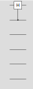
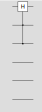
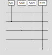

# GroverCircuitBuilder Module for Quantum Machine Learning

## Introduction
The GroverCircuitBuilder module in Julia automates the creation of quantum circuits specifically tailored for quantum machine learning applications. This module simplifies the process of setting up and running Grover's algorithm within the quantum machine learning context, enhancing both efficiency and accessibility for researchers and practitioners in the field.

## Installation

### Prerequisites
- Julia programming environment

### Setting Up the Module
1. Clone the repository or download the module files to your local machine.
2. Ensure that Julia and all necessary packages are installed.

## Usage

### Basic Setup and Module import

Include this code at the beginning on your script. This will automatically import all necessary modules.

```julia
include("../Modules/SetupTool.jl")
using .SetupTool
setupPackages(false, update_registry = false)
using Revise

Revise.includet("../Modules/GroverML.jl")
using .GroverML
Revise.includet("../Modules/GroverCircuitBuilder.jl")
using .GroverCircuitBuilder
Revise.includet("../Modules/GroverPlotting.jl")
using .GroverPlotting
configureYaoPlots()
using Yao
using Yao.EasyBuild, YaoPlots
```

### Target and model lanes

In our module, we divide the circuit into two main components, the `target lanes` and the `model lanes`. This division should help organize the circuit. The `target lanes` should contain all lanes that are controlled by model parameters. The `model lanes` are the parameters of the model.

By default, `target lanes` come before `model lanes`. If you want to apply any gate on a `target lane`, you can access the `n`-th `target lane` using the index `n`. If you want to access the `m`-th `model lane`, then you need to use the index `length(target lanes) + m`.

Keep in mind that the division into `target` and `model` lanes is helpful, but not necessary. In general, you can create any circuit you want and everything should still work.

### Creating a circuit

You can create a new circuit by:

```julia
# Initialize an empty circuit with 2 target lanes and 4 model lanes
grover_circ = empty_circuit(2, 4)
```

where the first argument is the total number of `target lanes` and the second argument is the total number of `model lanes`.

### Building a circuit

You can build circuits using the modules integrated functions. A circuit is built sequentially, meaning that new gates are added to the end of the circuit. For all examples, we assume to have `2` `target lanes` and `4` `model lanes` as in the [previous example](#creating-a-circuit).

#### Hadamard gates

You can apply Hadamard gates using the function `hadamard`.

```julia
hadamard(grover_circ, 3, false)
```

Assuming we have an empty circuit, this will add a Hadamard gate to the `3`-rd `lane`.


We can also apply Hadamard gates to multiple `lanes` at once, using either

```julia
hadamard(grover_circ, 1:3, false)
```

or

```julia
hadamard(grover_circ, [1, 2, 3], false)
```

This will add a Hadamard gate to the `1`-st, `2`-nd and `3`-rd `lane`.


You can also add controlled Hadamard gates by specifing the `control lanes`

```julia
hadamard(grover_circ, 1, false, control_lanes = 2)
```



Each hadamard gate can be controlled by multiple `control lanes`

```julia
hadamard(grover_circ, 1, false, control_lanes = [2:3])
```



You can also specify multiple controlled Hadamard gates at once

```julia
hadamard(grover_circ, 1:2, false, control_lanes = [3, 4:6])
```


#### Not gates

You can apply Not gates using the function `not`.

```julia
not(grover_circ, 3, false)
```


You can also apply multiple Not gates, as well as controlled Not gates, in the same way as for [Hadamard gates](#hadamard-gates).

```julia
not(grover_circ, 1:2, true, control_lanes = [3, 4:6])
```


#### Learned rotation gates

Learned rotations are granular rotations that can be learned by a classical optimizer. The granularity of such a `learned rotation` is dependent on the number of control lanes. In general, we can learn $2^n$ individual rotations where $n$ is the number of control lanes. This function is implemented as `learned_rotation`.

```julia
learned_rotation(grover_circ, 1, 3:6, true)
```



### Compiling a circuit

You can compile a circuit using the function `compile_circuit`.

```julia
my_circuit = compile_circuit(grover_circ)
```

This will compile the circuit and return a `Yao` circuit. You can also compile the inverse circuit using the flag `inv`.

```julia
my_circuit = compile_circuit(grover_circ, inv = true)
```

### Visualizing a circuit

You can visualize a circuit using the function `vizcircuit`.

```julia
vizcircuit(my_circuit)
```

### Visualize measurements

You can visualize the measurements of a circuit using the function `plotmeasure`.

```julia
plotmeasure(my_circuit)
```

For example, let's measure a learned rotation after applying Hadamard gates on the `model lanes`.

```julia
grover_circ = empty_circuit(1, 2)

hadamard(grover_circ, 2:3)
learned_rotation(grover_circ, 1, true, 2:3)

my_circuit = compile_circuit(grover_circ)
```

Now, we visualize the circuit:

```julia
vizcircuit(my_circuit)
```


And we visualize the measurements:

```julia
measurements = zero_state(3) |> my_circuit |> r->measure(r; nshots=1000)
plotmeasure(measurements)
```


Keep in mind that the last bit is our target lane, while the first two bits are our model lanes.

### Model training

Let's take create a model and train it on a simple dataset. We define the model as follows:

```julia
grover_circ = empty_circuit(1, 3)

hadamard(grover_circ, 2:4)
learned_rotation(grover_circ, 1, true, 2:4)
not(grover_circ, 1, true; control_lanes = [2:3])
```

We can visualize the circuit:

```julia
my_circuit = compile_circuit(grover_circ)
vizcircuit(my_circuit)
```


Let's have a look at the measurements without training the model:

```julia
measured = zero_state(4) |> my_circuit |> r->measure(r; nshots=1000)
plotmeasure(measured)
```


Let's say we want the model to map `|0>` to `|1>` (at the target lane). Thus, we want to minimize the states where the `target lane` does not return `1` (the last bit in the graph above). We can do that using the `auto_compute` function.

```julia
out, main_circuit, grover_iterations = auto_compute(grover_circ, 1, [true])
```

There parameter `1` specifies the `target lane`, while `[true]` specifies the `target value`. The function `auto_compute` will automatically compute the optimal number of Grover iterations and apply them to the circuit. Keep in mind that the `target lanes` do not have to match that specified `target lanes` of the circuit. In this context, the `target lanes` are the lanes that should produce a certain output, the `target value`. The function returns the quantum state after applying the circuit, the circuit without the amplitude amplification and the grover iterations as a circuit.
Executing this code should generate the following logs:

```
[ Info: Simulating grover circuit...
[ Info: Cumulative Pre-Probability: 0.588388347648318
[ Info: Angle towards orthogonal state: 0.8742534638200038
[ Info: Angle towards orthogonal state (deg): 50.091033701579434
[ Info: Optimal number of Grover iterations: 4
[ Info: Actual optimum from formula: 0.39836437131823643
[ Info: 
[ Info: ======== RESULTS ========
[ Info: =========================
[ Info: 
[ Info: Cumulative Probability (after 4x Grover): 0.9997955370807339
[ Info: Predicted likelihood after 4x Grover: 0.9997955370807381
```

As displayed in the logs, we could increase the probability of measuring a `1` at the target lane from `0.588` to `0.999` by applying `4` Grover iterations. 

When executing the function `auto_compute`, there are three outputs:
- `out`: The quantum state after applying the circuit including the amplitude amplification
- `main_circuit`: The compiled circuit without the amplitude amplification
- `grover_iterations`: The `4` grover iterations as a circuit

We can visualize the measured states using `1000` different measurements:

```julia
measured = out |> r->measure(r; nshots=1000)
plotmeasure(measured)
```


As we can see, the probability of measuring a `1` at the target lane is now much higher than before.

### Model training with multiple target values

We can also train a model that returns multiple target values. Let's define another model that has a two-bit output. Let's define the model as follows:

```julia
grover_circ = empty_circuit(2, 3)

# Apply Hadamard gates on the model lanes
hadamard(grover_circ, model_lanes(grover_circ), false)

# Apply a Learned Rotation on the first target lane
learned_rotation(grover_circ, target_lanes(grover_circ)[1], model_lanes(grover_circ), true)

# Apply a controlled Not gate on the second target lane
not(grover_circ, 2, true; control_lanes = [model_lanes(grover_circ)[1:2]])
```

We can visualize the circuit:

```julia
my_circuit = compile_circuit(grover_circ)
vizcircuit(my_circuit)
```


Now, let's train the model to return `|11>` at the `output lanes`. We can do that using the `auto_compute` function.

```julia
out, main_circuit, grover_iterations = auto_compute(grover_circ, target_lanes(grover_circ), [true, true])
```

Executing this code should generate the following logs:

```
[ Info: Simulating grover circuit...
[ Info: Inserting grover-lane after lane number 2
[ Info: Cumulative Pre-Probability: 0.08080582617584074
[ Info: Angle towards orthogonal state: 0.2882383126101803
[ Info: Angle towards orthogonal state (deg): 16.514838806535785
[ Info: Optimal number of Grover iterations: 2
[ Info: Actual optimum from formula: 2.2248222357575265
[ Info: 
[ Info: ======== RESULTS ========
[ Info: =========================
[ Info: 
[ Info: Cumulative Probability (after 2x Grover): 0.9832964456500823
[ Info: Predicted likelihood after 2x Grover: 0.9832964456500849
```

Now, we visualize the `main_circuit`:

```julia
vizcircuit(main_circuit)
```


When inspecting the `main_circuit`, we can observe that the circuit does not match the circuit we defined above. This is because if we add multiple `output values`, the module will automatically insert a `grover lane`, which is a lane that is controlled by all `output lanes`. This makes it possible to apply Grovers Algorithm only on the `grover lane`, as this lane is `|1>` if and only if all `output lanes` have the `output values`. Keep in mind that other changes to the `main_circuit` might occur when calling `auto_compute`, but these will not change the overall functionality of the circuit. If you are not sure what happened, please inspect the circuit to identify the differences.

### Batch training